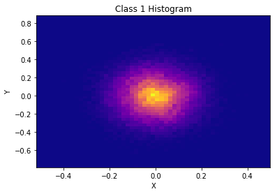

# Training ML algorithm
Supervised machine learning

### Objective
Given a balanced and labeled training set of 100,000 inputs with 8 features, attempt to correctly label the given unlabeled test set of 10,000 inputs. 

### Model Accuracy and Loss of training and validation sets over 100 epochs
   
  
### Final model scores after 100 epochs. 
|label         | precision |   recall | f1-score  | support|
| ------------- |:-------------:| -----:| -----:| -----:|
|0.0   |    0.94  |    0.95  |    0.95  |    4872|
1.0    |   0.95    |  0.95   |   0.95  |    5128|

|         | precision |   recall | f1-score  | support|
| ------------- |:-------------:| -----:| -----:| -----:|
micro avg   |    0.95   |  0.95   |   0.95  |   10000|
macro avg   |    0.95   |   0.95   |   0.95  |   10000|
weighted avg   |    0.95  |    0.95   |   0.95  |   10000|

|Type         | Score | 
| ------------- |:-------------:|
|Final Training Accuracy |  0.9515999995172024|
|Final Training Loss |  0.1549298545345664|
|Final Validation Accuracy |  0.9485999941825867|
|Final Validation Loss |  0.16442587226629257|
|Mean Training Accuracy |  0.8881981247104704|  
|Mean Validation Accuracy |  0.8933929995894431|  

# Hidden Data Structure

 

 

